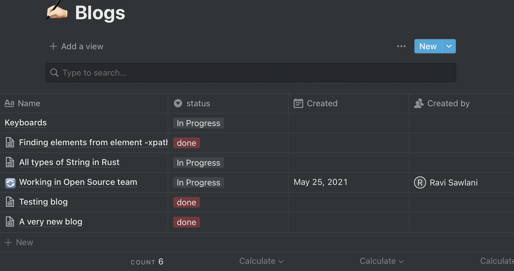

# Blogtion
Blogtion is a simple integration between Notion and static blog generator websites. There are lot of static site generator frameworks that are being to create bloging websites. 
Well the propasal is very simple to generate .md files which would then appear on your blog website. Well often times I end up using notion to draft initial version of my blog.
Notion is a great tool to manage your tasks and is also more intuitive then writing a .md file. As transfering the final draft to github became a task I came up with this integration where
as soon as we mark the blog `done` in Notion it appears on our blog website.

## 🔖 Notion setup
The Notion setup can look like below where there are some blogs which are marked as `In progress` and some as `done`.
 
 
.
You need also setup [Notion integration](https://www.notion.so/my-integrations) before taking advantage of this tool. 

## 👨‍💻 Github Setup
We can setup a github repository using github actions using any static site generator frameworks like [Hugo](https://gohugo.io/hosting-and-deployment/hosting-on-github/).
The github repository should be setup in a format, when a new file is created a blog post 
should show up on the website using one of the static site generator websites.

## ✨ Bringing best of both worlds (Integration)
 We need to setup some environment variable inorder to make this integration work.
 
| environment | usage  |
| :-------:   | :----: |
| GITHUB_ACCESS_TOKEN     | To access your github account. [check here](https://docs.github.com/en/authentication/keeping-your-account-and-data-secure/creating-a-personal-access-token) |
| NOTION_SECRET_KEY| To authorize your Notion account. [check here](https://developers.notion.com/docs/getting-started)  |
| GITHUB_REPO_NAME | Repo to push the content to. Repository name, for example `blogtion` |
| GITHUB_USER_NAME | Username of the github account.For example `gravityvi` |
| GITHUB_FILE_PATH | Relative path to push the files to github. static site generator would use content from a file, for example `content/posts/` |
| NOTION_DATABASE_ID | Notion page to fetch the blog data. [check here](https://developers.notion.com/docs/getting-started#step-2-share-a-database-with-your-integration) |
| GITHUB_BRANCH_NAME | Github branch to use while pushing data. For example `main` |

This completes your setup.

## 🚀 Deployment
 The final step is to deploy the tool to run as per your preferences. I am using [Heroku Scheduler](https://devcenter.heroku.com/articles/scheduler#installing-the-add-on) that runs on code on specific duration and push the updates to github. 
 **Note : Updates are only pushed if there are some changes**

 ## 👾 Fun Facts
The whole application has been coded and deployed using a computer which is not a computer.
Special thanks to [replit.com](replict.com) ✨ for making this possible.

.
